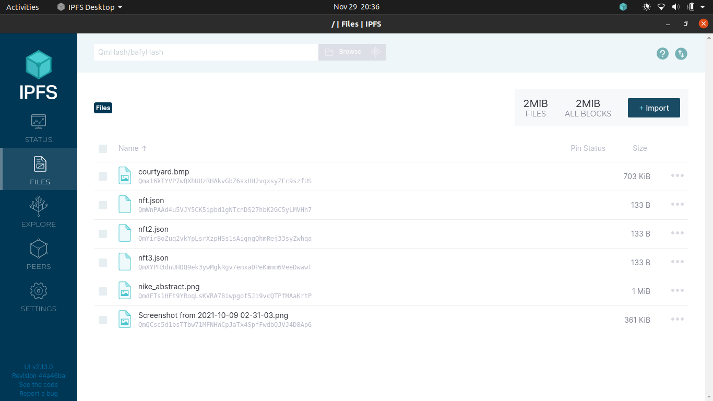
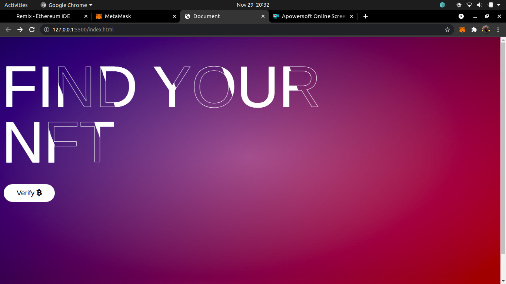
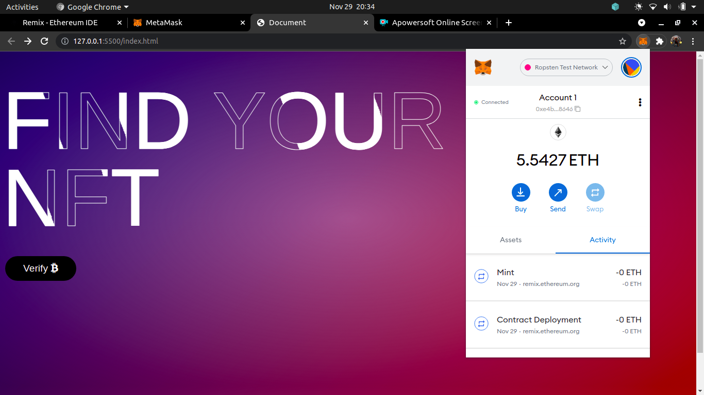
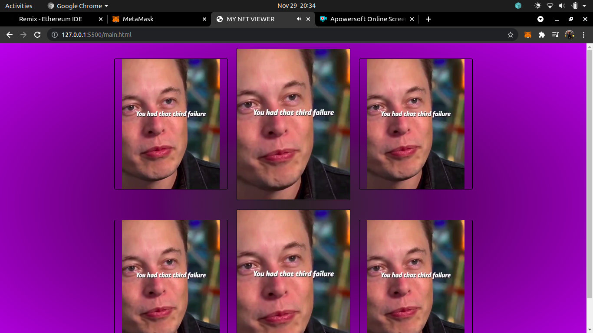
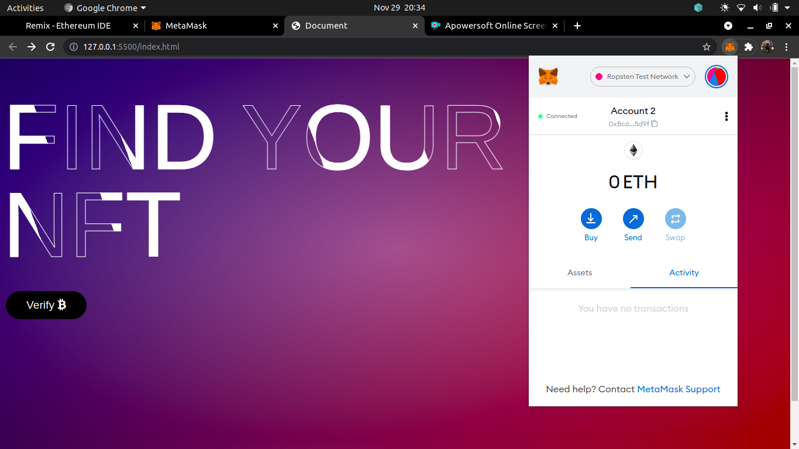
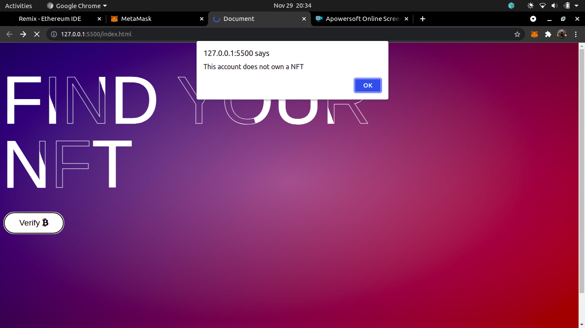
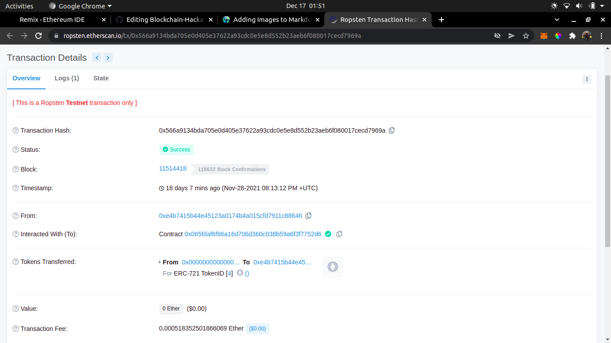
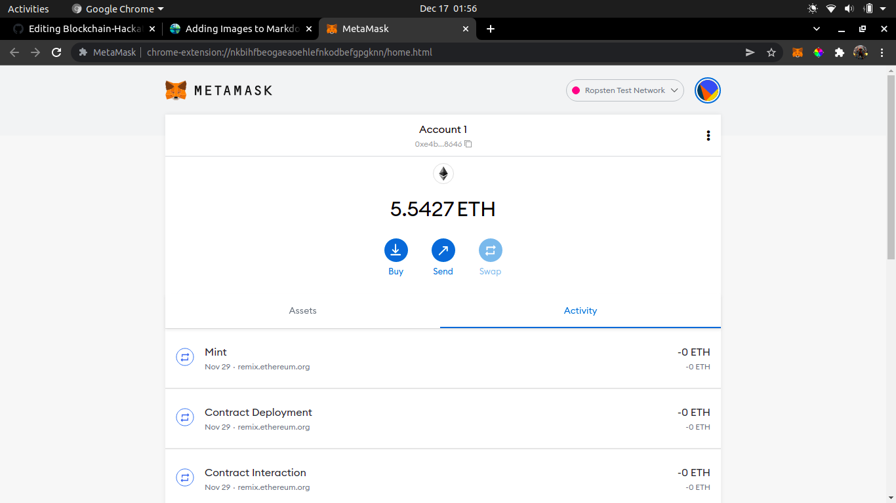

# Blockchain-Hackathon
## Problem Statement
1. Mint a set of NFTs
2. Build a page that plays a video
3. This page can only be accessed if you own atleast one of the minted NFTs
## Our solution (1st place)
Giving a brief overview of the files: 
#### 1. Using the **Remix** IDE, we were able to describe our smart contract named newNFT in the ```nft.sol``` file. This smart contract consists of functions required to mint nfts, transfer nfts from one user to another and also a validating function to verify if a given account/user owns one among the many minted nfts. This function further helps us to determine whether the user should be given access to the webpage consisting the video. Through the IDE, we are able to mint these nfts and also have account 1 as their owner (for demonstrating  the functioning of the above functions). The following are the files on ipfs used in the process of minting nfts.



#### 2. The homepage is shown below ```index.html``` wherein the page prompts the user to select (if not already done!) their account on the metamask wallet extension. We have made use of test ether for demonstrating purposes on the ropsten test network. Once the user wishes to proceed onto the next page, they click the button shown below which then calls the validating function as described earlier and determines whether the user should be allowed to view the video or not. As account 1 is the owner of the nfts, they will be able to view the video (described in ```main.html```.







#### 3. Similarly if we try the same procedure for account 2 which doesn't own any nft, it will be denied access to the video with an alert indicating the same.





## Conclusion

#### Finally, to show that account 1 has nfts minted, we are able to view the (Ropsten testnet) transaction on ether scan and also the activity on metamask wallet extension as follows





### Contributors

<html>
  <a href="https://github.com/chandan2300">
</html>

